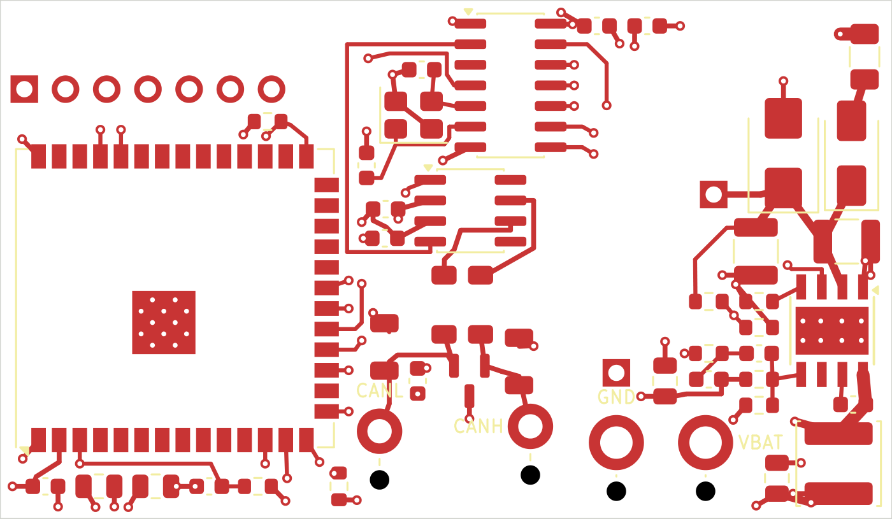

# CANFD-MC — a minimal CAN board for a motorcycle

A 55 × 32 mm, 4-layer board that replaces the LilyGO T-2CANFD in the
[indian-thunderstroke-canbus](https://github.com/Prinsessen/indian-thunderstroke-canbus)
project: ESP32-S3-WROOM-1U + MCP2518FD + TCAN332G, fed from the bike's
permanent 12 V through an LM5164 buck. Same pin map as the LilyGO board, so the
firmware runs unchanged (`sniffer-t2can` environment).



What it drops from the LilyGO board, on purpose: the isolated transceiver (one
machine, one ground — the isolation was bridged the moment it was wired in, and
its DC-DC was three quarters of the sleep current), the USB connector, the screw
terminals, the second CAN channel, and the 120 Ω termination (the bike's bus is
already terminated; a third resistor is a stub). What it adds: a 6–40 V input
that survives load dump, four solder pads with strain-relief holes instead of
connectors, and a ~10 µA regulator so the board can live on the battery.

## Layout

```
canfd-mc.kicad_pro / .kicad_sch / .kicad_pcb   KiCad 10 project — placed, routed, DRC clean
canfd_local.pretty/                            three project footprints (solder pads with relief
                                               holes, Murata DLW43SH with Murata's pin numbering)
production/                                    what JLCPCB was sent: Gerber zip, BOM, CPL
docs/design-document.html                      the full design document: BOM, net list, the
                                               LM5164 calculation, layout rules, checklist
docs/BUILD-NOTES.md                            build, ordering and bring-up notes
docs/WIRING-PARTS.md                           antenna and service-connector cable to order
```

## Connections

Four wires from the service connector, soldered to plated pads along the bottom
edge — **CANL · CANH · GND · VBAT**. Each pad has an unplated 1.2 mm hole 3 mm
inboard: thread the wire up through the hole and down into the pad, so the
board takes the strain instead of the solder joint. No shield pad: the bus
shield is grounded at the ECM.

Flash header on the back (through-hole from rev 1.1, flat pads on rev 1.0), 2.54 mm pitch —
**GND · EN · TX · RX · IO0 · USB_D+ · USB_D−**.
First flash goes over the ESP32-S3's native USB (a cut USB cable on D+/D−/GND;
the board is powered from 12 V, not from USB). After that, OTA.

## Power input

| | |
|---|---|
| Input | 6–40 V (LM5164 is rated to 100 V; the TVS clamps load dump at ~39 V) |
| UVLO | on at 7.0 V, off at 6.5 V |
| Output | 3.3 V, 300 kHz, 1 A rating (real load < 0.5 A) |
| Protection | 1 A fuse, series Schottky (reverse polarity), SMBJ24CA |

The buck was calculated from the LM5164 datasheet equations and confirmed with
TI's WEBENCH: RON, inductor and bootstrap capacitor came out identical.

## Status

Rev 1.0 ordered from JLCPCB in September 2026 (5 boards, assembled) — on `main`.
Rev 1.1 (85 °C module, through-hole flash header and test pads) is on the
`rev1.1` branch, ready but unordered until rev 1.0 has been tested. Reviewed
([docs/REVIEW-rev1.0.md](docs/REVIEW-rev1.0.md)): net list confirmed against the
datasheets, three notes for rev 1.1. Not yet tested on
hardware — this is a first revision, and the bring-up checklist in the design
document is the plan for finding out what it got wrong.

Things a second revision might change are tracked in the design document's
open-points table.

## Licence

MIT, like the firmware. Design and silkscreen: Springcommand — Nanna Agesen 2026.
